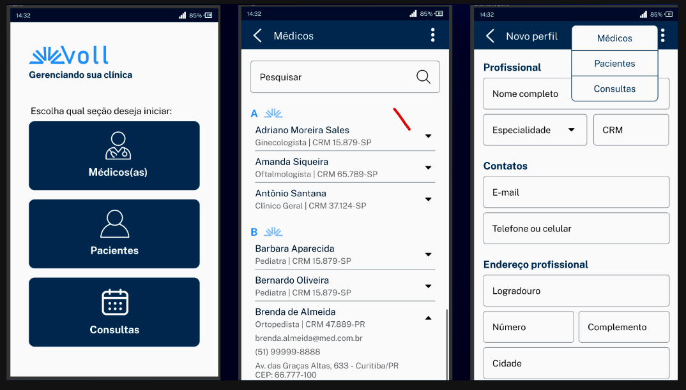

<b><h1>Objetivo</h1></b>

• Desenvolvimento de uma API Rest

• CRUD (Create, Read, Update e Delete)

• Validações

• Paginação e ordenação

<b><h2>Tecnologias</h2></b>

**• Spring Boot 3**

**• Java 17**

**• Lombok:**
Responsável por fazer a geração de códigos repetitivos, como getters, setters, toString, entre outros. Tudo via anotações para o código ficar menos verboso.

**• MySQL/ Flyway:**
Para armazenar as informações da API e junto com ele utilizaremos a biblioteca Flyway. Isso para termos o controle do histórico de evolução do banco de dados, um conceito que chamamos de Migration.

**• JPA/Hibernate:**
A camada de persistência da nossa aplicação será feita com a JPA (Java Persistence API), com o Hibernate como implementação dessa especificação e usando os módulos do Spring Boot, para tornar esse processo o mais simples possível.

**• Maven:**
Gerenciar as dependências do projeto, e também para gerar o build da nossa aplicação.

**• Insomnia:**
Sendo uma ferramenta usada para testes em API.

**• Spring DATA JPA:**
Realizar as conexões com banco de data.

**• MySQL Driver:**
Banco de dados utilizado para gerenciar dados.

**• Flyway:**
Migrations, utilzado para controle de versão(registro de mudanças) do banco de dados.

**Bean Validation:**
Realização das validações através de anotações no controller e no DTO (Data Transfer Object)/Record.

<b><h2>Protótipo</h2></b>
As imagens abaixo são apenas representativas, será desenvolvido apenas o back-end.

Empresa chamada Voll Med(fictícia), que possui uma clínica que precisa de um aplicativo para monitorar o cadastro de médicos, pacientes e agendamento de consultas.

Será um aplicativo com algumas opções, em que a pessoa que for usar pode fazer o <b>CRUD</b>, tanto de médicos quanto de pacientes e o agendamento e cancelamento das consultas.

